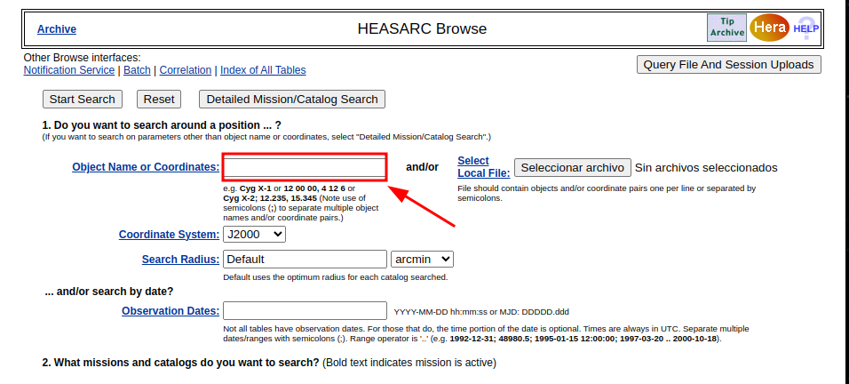
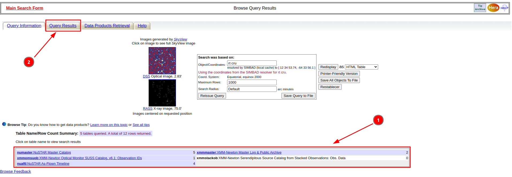
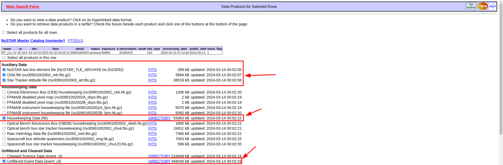
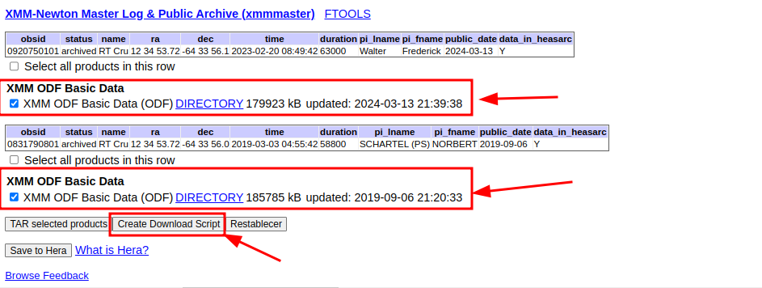

# Descarga de observaciones (RX)

A continuación se enumeran los pasos para obtener los datos “crudos” de las observaciones de NuSTAR y XMM-Newton.

1. Ingresar al sitio https://heasarc.gsfc.nasa.gov/cgi-bin/W3Browse/w3browse.pl.
2. Ingresar el nombre del objeto:

3. Seleccionar las misiones de interés.

/image2.png)

1. Seleccionar solamente “Archived data and observations” y luego hacer click en “Start search”.

1. Una vez que se hayan cargado los registros en la página con los resultados de la búsqueda, se debe seleccionar la pestaña “Query results”:

1. Para el caso de NuSTAR, se deben seleccionar las observaciones deseadas y luego, en la sección “Data products”, seleccionar “Auxiliary data”, “Housekeeping data” y “Unfiltered and cleaned data”.

En el caso de XMM-Newton, elegir las observaciones deseadas dentro de la pestaña “xmmmaster” y en la sección “Data products” seleccionar solamente “XMM ODF Basic Data”.

1. En la pestaña “Data Products Retrieval”, hacer click en el botón “Preview and Retrieve”. Verificar que estén seleccionadas las observaciones a descargar.

1. Se abre una nueva pestaña en el navegador en donde es posible seleccionar los archivos a descargar de manera más específica de cada observación. Para el caso de NuSTAR, elegir solamente los archivos dentro de la sección “Auxiliary Data”, el directorio “Housekeeping Data” y el directorio “Unfiltered Event Data”

Para el caso de XMM-Newton, seleccionar los directorios con los ODF correspondientes a cada observación.

1. Luego, hacer click en el botón “Create Download Script”.
2. Se abre otra pestaña del navegador en donde se listan los comandos para descargar cada una de los archivos. Estos se pueden copiar y pegar en una terminar la para comenzar la descarga. También se puede descargar un archivo de texto con los comando incluidos por si llega a haber algún problema y tener que repetir estos pasos.

**Nota**: Conviene crear un script que ejecute la descarga de las observaciones para cada misión.

[Volver al menú principal](../README.md).